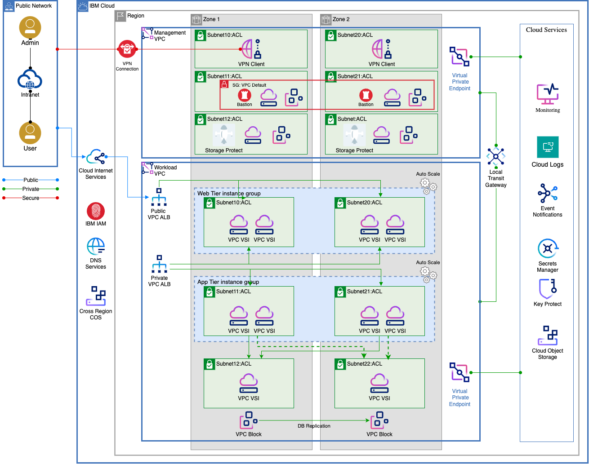
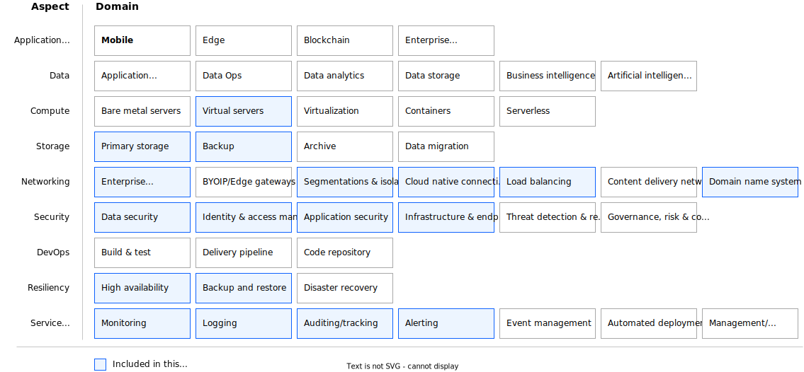

---

copyright:
  years: 2023
lastupdated: "2023-12-15"

keywords: # Not typically populated

subcollection: pattern-vpc-vsi-multizone-resiliency

authors:
  - name: Carol Hernandez
    url: https://linkedin.com/in/carolbhernandez

# The release that the reference architecture describes
version: 1.0

# Use if the reference architecture has deployable code.
# Value is the URL to land the user in the IBM Cloud catalog details page for the deployable architecture.
# See https://test.cloud.ibm.com/docs/get-coding?topic=get-coding-deploy-button
deployment-url:

docs: https://cloud.ibm.com/docs/pattern-vpc-vsi-multizone-resiliency

# use-case from 'code' column in
# https://github.ibm.com/digital/taxonomy/blob/main/topics/topics_flat_list.csv
use-case: VirtualPrivateCloud

content-type: reference-architecture

---

{{site.data.keyword.attribute-definition-list}}

# Web app multi-zone resiliency
{: #web-app-multi-zone}
{: toc-content-type="reference-architecture"}
{: toc-use-case="VirtualPrivateCloud"}
{: toc-version="1.0"}

The web app multi-zone resiliency architecture deploys a 3-tier web application on Virtual Servers for VPC by using compute, storage, and network cloud resources as well as other Cloud services provisioned across multiple availability zones within a single region.

## Architecture diagram
{: #architecture-diagram}

{: caption="Figure 1. Web app multi-zone resiliency solution architecture" caption-side="bottom"}

The Web, Application, and Database tiers are deployed on Virtual Servers for VPC (VPC VSIs) across two availability zones within the Workload VPC.
- The virtual servers in the web and app tiers are placed within [Placement Groups](/docs/vpc?topic=vpc-about-placement-groups-for-vpc&interface=ui) for host failure protection and are part of [Instance Groups](/docs/vpc?topic=vpc-creating-auto-scale-instance-group&interface=ui) for autoscaling. A [VPC Application Load Balancer](/docs/vpc?topic=vpc-load-balancers) is used to route traffic to healthy application servers.
- The database servers are deployed in active-standby mode. Data replication across availability zones is handled by the database software based on database specific high availability configuration options.
- IBM Storage Protect is used to create database backups to enable data recovery.

All data is encrypted by using customer-provided keys that are managed by [Key Protect](/docs/key-protect?topic=key-protect-about).
- All storage is encrypted at rest with customer-provided keys.
- Data is encrypted in transit that uses TLS encryption. [Secrets Manager](https://cloud.ibm.com/catalog/services/secrets-manager){: external} is used to store and manage SSL/TLS certificates.
- The [Cloud Internet Services (CIS)](/docs/cis?topic=cis-getting-started) is deployed as a proxy to the public VPC Application Load Balancer that front ends the web tier to provide Distributed Denial of Service (DDoS) protection and Web Application Firewall protection.

## Design scope
{: #design-scope}

The web app multi-zone resiliency architecture covers [design considerations](/docs/pattern-vpc-vsi-multizone-resiliency?topic=pattern-vpc-vsi-multizone-resiliency-compute-design) and [architecture decisions](/docs/pattern-vpc-vsi-multizone-resiliency?topic=pattern-vpc-vsi-multizone-resiliency-compute-design) for the following aspects and domains (as defined in the [Architecture Framework](/docs/architecture-framework?topic=architecture-framework-intro)):

- **Compute:** Virtual Servers
- **Storage:** Primary Storage, Backup Storage
- **Networking:** Enterprise Connectivity, Segmentation and Isolation, Cloud Native Connectivity, Load Balancing, Domain Name System
- **Security:** Data Security, Identity and Access Management, Application Security, Infrastructure and Endpoint Security
- **Resiliency:** High Availability, Backup and Restore,
- **Service Management:** Monitoring, Logging, Auditing, Alerting

 {: caption="Figure 2. Web app multi-zone resiliency architecture design scope" caption-side="bottom"}

The Architecture Framework provides a consistent approach to design cloud solutions by addressing requirements across a set of "aspects" and "domains", which are technology-agnostic architectural areas that need to be considered for any enterprise solution. See [Introduction to the Architecture Framework](/docs/architecture-framework?topic=architecture-framework-intro) for more details.

## Requirements
{: #requirements}

The following represents a typical set of requirements for enterprise-ready web applications that are deployed in a public cloud.

| Aspects | Requirements |
| -------------- | -------------- |
| Compute            | Provide properly isolated compute resources with adequate compute capacity for the applications. |
| Storage            | Provide storage that meets the application and database performance requirements. |
| Networking         | * Deploy workloads in an isolated environment and enforce information flow policies. \n * Provide secure, encrypted connectivity to the cloud’s private network for management purposes. \n * Distribute incoming application requests across available compute resources. \n * Provide public and private DNS resolution. |
| Security           | * Ensure that all operator actions are run securely through a bastion host. \n * Protect the boundaries of the application against denial-of-service and application-layer attacks. \n * Encrypt all application data in transit and at rest to protect it from unauthorized disclosure. \n * Encrypt all backup data to protect it from unauthorized disclosure. \n * Encrypt all security data (operational and audit logs) to protect from unauthorized disclosure. \n * Encrypt all data by using customer-managed keys to meet regulatory compliance requirements for more security and customer control. \n * Protect secrets through their entire lifecycle and secure them using access control measures. |
| Resiliency         | * Support application availability targets and business continuity policies. \n * Provide highly available compute, storage, network, and other cloud services to handle application load and performance requirements. \n * Backup application data to enable recovery if unplanned outages occur. \n * Provide highly available storage for security data (logs) and backup data. |
| Service Management | * Monitor system and application health metrics and logs to detect issues that might impact the availability of the application. \n * Generate alerts/notifications about issues that might impact the availability of applications to trigger appropriate responses that minimize downtime. \n * Monitor audit logs to track changes and detect potential security problems. \n * Provide a mechanism to identify and send notifications about issues that are found in audit logs. |
{: caption="Table 1. Web app multi-zone resiliency requirements" caption-side="bottom"}

## Components
{: #components}

| Aspects | Solution components | How the component is used |
| -------------- | -------------- | -------------- |
| Compute            | [Virtual Servers for VPC](https://cloud.ibm.com/vpc-ext/provision/vs){: external}                                                                                                                                                                   | Web, App, and database servers                                                                                                        |
| Storage            | [Block Storage for VPC](/docs/openshift?topic=openshift-vpc-block)                                                                                                                                      | Database servers storage                                                                                                              |
|                    | [Cloud Object Storage](/docs/cloud-object-storage?topic=cloud-object-storage-about-cloud-object-storage)                                                                                      | Web app static content, backups, logs (application, operational, and audit)                                                       |
| Networking         | [VPC Virtual Private Network (VPN) Client](/docs/iaas-vpn?topic=iaas-vpn-getting-started)                                                                                                           | Remote access to manage resources in a private network                                                                                  |
|                    | [Virtual Private Clouds (VPCs), Subnets, Security Groups (SGs), ACLs](/docs/vpc?topic=vpc-getting-started)                                                                                          | VPCs for workload isolation. \n Subnets, SGs, and ACLs for restricted access to web, app, and database tiers                              |
|                    | [Local Transit Gateway (TGW)](/docs/transit-gateway?topic=transit-gateway-getting-started)                                                                                                                | Connectivity between workload and management VPCs |
|                    | [Virtual Private Gateway & Virtual Private Endpoint (VPE)](/docs/vpc?topic=vpc-about-vpe)            | Private network access to Cloud Services, for example Key Protect, Cloud Object Storage, and so on                                                                 |
|                    | [VPC Application Load Balancer](/docs/vpc?topic=vpc-load-balancers)                                                                                                                                 | Application Load Balancing for web and app tiers                                                                                      |
|                    | [Public Gateway](/docs/vpc?topic=vpc-about-networking-for-vpc&interface=cli#public-gateway-for-external-connectivity)                                                                               | Web app access to the internet                                                                                                        |
|                    | [Cloud Internet Services (CIS)](/docs/cis?topic=cis-getting-started)                                                                                                                                | Public DNS resolution                                                                         |
|                    | [DNS Services](/docs/dns-svcs?topic=dns-svcs-about-dns-services)                                                                                                                                    | Private DNS resolution                                                                                                                |
| Security           | [IAM](/docs/account?topic=account-cloudaccess)                                                                                                                                                      | IBM Cloud Identity & Access Management                                                                                                |
|                    | [BYO Bastion Host on VPC VSI with PAM SW](/docs/framework-financial-services?topic=framework-financial-services-vpc-architecture-connectivity-bastion-tutorial-teleport)                            | Remote access with Privileged Access Management                                                                                      |
|                    | [Cloud Internet Services (CIS)](/docs/cis?topic=cis-getting-started)                                                                                                                                | DDoS protection and Web App Firewall                                                                                                  |
|                    | [Key Protect](/docs/key-protect?topic=key-protect-about)                                                                                                                                            | Key Management Service                                                                                                                |
|                    | [Secrets Manager](https://cloud.ibm.com/catalog/services/secrets-manager){: external}                                              | Certificate and Secrets Management                                                                                                    |
| Resiliency         | [Placement Groups](/docs/vpc?topic=vpc-about-placement-groups-for-vpc&interface=ui) and [Instance Groups](/docs/vpc?topic=vpc-creating-auto-scale-instance-group&interface=ui) | To avoid single points of failure and adjust capacity based on load changes                                                           |
|                    | VPC VSIs, VPC Block across multiple zones in one region                                                                                                                                                                 | Web, app, database high availability deployment                                                                            |
|                    | [IBM Storage Protect](https://cloud.ibm.com/catalog/content/SPonIBMCloud-20c54034-d319-48c0-beb6-0b4adc54265c-global){: external}         | Database backups                                                                                                                      |
|                    | [Cross-Region Cloud Object Storage Buckets](/docs/cloud-object-storage/basics?topic=cloud-object-storage-endpoints#endpoints-geo)                                                                                    | Backup storage                                                                                                                       |
| Service Management | [IBM Cloud Monitoring](/docs/monitoring?topic=monitoring-about-monitor)                                                                                                                             | Apps and operational monitoring                                                                                                      |
|                    | [IBM Log Analysis](/docs/log-analysis?topic=log-analysis-getting-started)                                                                                                                           | Apps and operational logs                                                                                                             |
|                    | [IBM Cloud Activity Tracker](/docs/activity-tracker?topic=activity-tracker-getting-started)                                                                                                         | Audit logs                                                                                                                            |
{: caption="Table 2. Web app multi-zone resiliency components" caption-side="bottom"}
